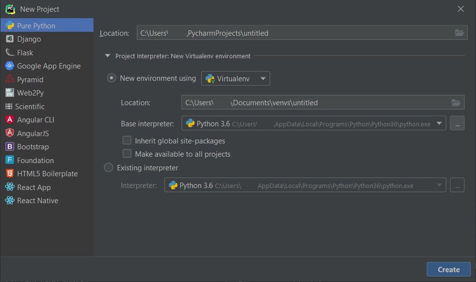
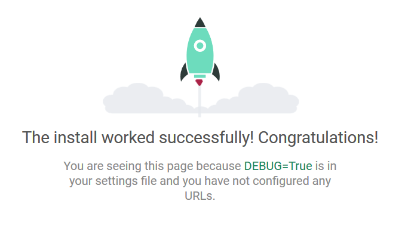

# Contenidos

- [Contenidos](#contenidos)
- [Repaso](#repaso)
  - [Entornos virtuales y su importancia](#entornos-virtuales-y-su-importancia)
    - [Creación de un ambiente virtual (línea de comandos)](#creaci%c3%b3n-de-un-ambiente-virtual-l%c3%adnea-de-comandos)
    - [Creación de un ambiente virtual (PyCharm)](#creaci%c3%b3n-de-un-ambiente-virtual-pycharm)
  - [Creación de un proyecto Django (PyCharm)](#creaci%c3%b3n-de-un-proyecto-django-pycharm)
  - [Recuerdo de cosas importantes](#recuerdo-de-cosas-importantes)
    - [Aplicaciones Django](#aplicaciones-django)
      - [Modelos](#modelos)
      - [Vistas](#vistas)
    - [¿Cómo Django decide qué mostrarnos al acceder a una url?](#%c2%bfc%c3%b3mo-django-decide-qu%c3%a9-mostrarnos-al-acceder-a-una-url)
    - [Templates](#templates)
    - [Archivos en modelos](#archivos-en-modelos)
    - [Gestión mediante Django admin](#gesti%c3%b3n-mediante-django-admin)
- [Extendiendo nuestra aplicación](#extendiendo-nuestra-aplicaci%c3%b3n)
  - [Formularios](#formularios)
    - [Vistas basadas en funciones](#vistas-basadas-en-funciones)
    - [Vistas basadas en clases](#vistas-basadas-en-clases)
    - [Formularios HTML](#formularios-html)
    - [Forms de Django](#forms-de-django)
  - [Extendiendo el user de Django](#extendiendo-el-user-de-django)

# Repaso
## Entornos virtuales y su importancia

En python se suelen utilizar librerías no incluídas en el lenguaje según la aplicació o programa que estemos haciendo. Esto es útil porque, de esta manera, podemos tener distintas versiones de distintas librerías sin que entren en conflicto entre ellas.

Además, tener pocos paquetes nos sirve para crear un archivo de _requisitos_ más fácilmente, lo que puede ayudar a otras personas si quieren instalar nuestra aplicación en otro computador.

### Creación de un ambiente virtual (línea de comandos)

Para crear y manejar entornos virtuales, existe una herramienta que se llama _virtualenv_. Para instalarla (después de haber instalado un python como base), podemos hacer

```
pip install virtualenv
```
Si se está instalando globalmente, es posible que necesite correr el comando anterior con privilegios de administrador (_con sudo_)

Luego, podemos crear un ambiente virtual (en la carpeta actual) usando

```
virtualenv {nombre ambiente} (--python={versión python})
```

La variable `{nombre ambiente}` es el nombre que recibirá nuestro ambiente virtual, y que nos puede ayudar a identificarlo

Lo que está entre paréntesis es opcional, y es por si tenemos más de una versión de Python instalada, y queremos específicar la versión que se usará como base para nuestro ambiente virtual. Incluso pueden crear ambientes virtuales con Python 2 (no lo hagan)

Les recomiendo que mantengan todos sus ambientes virtual en una misma carpeta, por efectos de orden. Hay personas que prefieren ponerlas en la misma carpeta que el proyecto que están haciendo, lo que igual pueden hacer, mientras recuerden no versionar el entorno.

Después de crear el ambiente, podemos _activarlo_ haciendo

```
cd {nombre ambiente}
source bin/activate
```

Si están en Windows, deben cambiar la última línea por `source Scripts/activate.bat`.

Después de esto, todos los comandos que usen Python se harán en este entorno virtual: los paquetes se instalarán en el entorno, y cada comando que se ocupe usará esa versión de Python, con los paquetes disponibles para el entorno. Pueden desactivar el entorno escribiendo el comando `deactivate`

Para instalar un paquete en el entorno, por ejemplo Django, pueden hacer `pip install Django`

### Creación de un ambiente virtual (PyCharm)

Al crear un proyecto en PyCharm, nos dará la opción inmediatamente de crear un entorno virtual, como se puede ver en la siguiente imagen:



Bajo _"New environment using"_ podemos elegir el lugar donde queremos guardar el entorno virtual, y el intérprete de Python que queremos usar como base.

Más tarde, podemos agregarle paquetes a nuestro entorno virtual, en el menú `File  > Settings > Project > Project Interpreter`. Para agregar un nuevo paquete, apretamos el símbolo + que aparece ahí. Luego se escribe el nombre del paquete en la barra de búsqueda que sale en la parte superior. Para instalarlo, lo seleccionamos d ela lista de la izquierda, y apretamos el botón de abajo que dice `Install package`.

## Creación de un proyecto Django (PyCharm)

Desde aquí en adelante, todas las operaciones se harán desde PyCharm, pues vieron cómo se hacen desde la línea de comandos en cátedra.

Para crear un proyecto, simplemente vamos a `File > New Project...`, y en la izquierda de la ventana (ver imagen anterior) seleccionamos Django. El nombre del proyecto Django será el nombre de la última carpeta que ponemos en _Location_. Con esto, ya podemos correr nuestro proyecto Django.

Desde PyCharm se puede apretar el botón _Play_, que está cerca de la esquina superior izquierda. Si prefieren usar la terminal, se puede correr el mismo proyecto usando `python manage.py runserver`



En clases hicimos un proyecto bien básico, en el que creamos un modelo simple, hicimos un modelo, una vista básica y una template, igual básica. Si no fueron, o no se acuerdan, pueden ver y descargar el código de esa aplicación [acá](https://github.com/sleivav/aux3/tree/master/demo_aux).

## Recuerdo de cosas importantes

Como no me respondieron en el foro si querían que ponga lo que ya habíamos hecho, sólo repasaré las cosas importantes. Si tienen dudas, me las pueden hacer llegar.

### Aplicaciones Django

Se pueden crear aplicaciones de Django usando el comando

```
python manage.py startapp {nombre app}
```

Las aplicaciones son un paquete de archivos python con los archivos admin, apps, models, tests y views.

Para que Django "reconozca" nuestra aplicación, tenemos que modificar el archivo `settings.py`, y agregar al arreglo `INSTALLED_APPS` el nombre de la aplicación que creamos

Los más importantes para poder mostrar algo son `models.py` y `views.py`

#### Modelos

Los modelos en Python son para _modelar_ una tabla de una base de datos. Su estructura básica es la siguiente:

```python
class NombreModelo(models.Model):
    nombre = models.CharField(max_length=100, default='Sin nombre')
    ...
```

Cada uno de los campos de la clase corresponde a una columna en la tabla, y NombreModelo es el nombre de la tabla en la base de datos.

Además de CharField, se pueden definir campos con Fields equivalentes a otros tipos de datos SQL (por ejemplo, IntegerField para enteros).

Se pueden establecer relaciones entre distintos modelos, usando ManyToManyFields, OneToOneFields y ForeignKeys (que serían Many to One). En ese caso, tenemos que pasar como parámetro el Modelo con el que se relaciona el actual, como en el ejemplo que vimos en clases:

```python
class Farm(models.Model):
    name = models.CharField(max_length=30)
    owner = models.ForeignKey(Owner, models.SET_NULL, null=True, blank=True)
```

En este caso, el campo _owner_ es una llave foránea a otra tabla, llamada Owner. El segundo parámetro es lo que pasa con el campo si es que eliminamos el Owner relacionado, y es el equivalente al `ON DELETE` en sql. El tercer parámetro nos permite guardar el campo como null, mientras que el último permite que se rellene un formulario relacionado al modelo con el campo en blanco.

Las relaciones se pueden acceder desde ambos lados. Por ejemplo, en el caso anterior, desde una `farm` podemos hacer `farm.owner` para obtener el objeto `Owner` con el que se relaciona. Desde un objeto `owner`, podemos hacer `owner.farm_set` para obtener el conjunto de `farm` relacionadas. No es necesario definir este set en la clase `Owner`, pues Django lo hace automáticamente

#### Vistas

En Django, las views se encargan de hacer cambios en los objetos de nuestros modelos (agregar, eliminar o editar), o pasárselos a una template. También están a cargo de responderle al usuario, por lo que deben retornar una `HttpResponse`. En el ejemplo que vimos en clases:

```python
def primera_pagina(request):
    farm_animals = FarmAnimal.objects.all()
    return render(request, 'demo_aux/index.html',
                  {'farm_animals': farm_animals})
```

Primero se obtienen todos los animales del modelo FarmAnimal, y luego se retorna con el método `render`, que es un método que retorna una `HttpResponse`. El primer argumento es el mismo request que le llega a la vista, y del que se encarga Django. Desde él, por ejemplo, podemos acceder al usuario que realizó la petición (`request.user`). El segundo argumento es la template que queremos mostrar al usuario (más adelante se verá mejor cómo funcionan), mientras que el tercero se conoce como _contexto_, y es un diccionario con variables que queremos que se puedan acceder desde la template.

Django tiene views genéricas, que sirven para hacer operaciones comunes sin definirlas de nuevo, pueden leer más al respecto [acá](https://docs.djangoproject.com/en/2.2/ref/class-based-views/generic-editing/)

### ¿Cómo Django decide qué mostrarnos al acceder a una url?

Cuando accedemos a una url, Django busca en el archivo urls.py de la carpeta principal del proyecto un arreglo que se llama `urlpatterns`. Pdemos cambiar el archivo en el que lo busca, cambiando el valor de `ROOT_URLCONF` en el archivo `settings.py`.

Luego, Django busca secuencialmente en el arreglo si hay alguno que calza con la url. Si hay un include, se mete al archivo de urls incluido (se podría decir que hace depth-first search).

Las urls se definen con el método `path`, por ejemplo: 

```python
urlpatterns = [
    path('primera_pagina', views.primera_pagina)
    ...
]
```

El primer argumento es la url a la que se accede, por ejemplo, `localhost:8000/primera_pagina`.

Cuando el usuario accede a esa url, se llama al método `primera_pagina` en views.py, por lo que el usuario termina viendo la template especificada en ese método.

El método `path` también puede recibir más argumentos, y nos permite recibir información variable de la url ingresada. Para revisar eso, pueden ver su documentación [acá](https://docs.djangoproject.com/en/2.2/ref/urls/#django.urls.path). Les recomiendo también que lean la documentación de [include](https://docs.djangoproject.com/en/2.2/ref/urls/#django.urls.include).

### Templates

Las templates de Django son archivos HTML con una sintaxis especial. Son útiles, pues nos permiten tener herencia, con lo que evitamos duplicar bloques de HTML.

Se guardan en la carpeta `templates` de nuestro proyecto, aunque esto se puede modificar en `settings`. Es conveniente crear subcarpetas dentro de `templates`, para separarlas por aplicación.

Además de HTML puro, podemos definir de qué template se hereda, poniendo en la primera línea

```django

```

En el archivo base, podemos definir bloques, usando la sintaxis

```django


```

En el archivo que hereda, si ponemos un bloque con el mismo nombre, al momento de renderizar el HTML, se reemplazará el bloque por el del archivo indicado en la vista.

También podemos acceder a variables usando `{{}}`. En el mismo ejemplo anterior, podemos hacer `{{ farm_animals }}`, lo que insertará la variable que pasamos desde views al HTML. Podemos recorrer un QuerySet usando un for, cuya sintaxis es:

```django

    {{ animal.name }}

```

Lo anterior recorrerá el Set en un for, e insertará el valor del campo name de cada uno de los animales del Set. Pueden leer más de el lenguaje de las templates de Django [acá](https://docs.djangoproject.com/en/2.2/topics/templates/#the-django-template-language)

### Archivos en modelos

Podemos asociar archivos a nuestros modelos. Por ejemplo, podemos agregar imágenes usando `models.ImageField(upload_to='fotos', default='fotos/404.jpg')`

El parámetro `upload_to` le dice a Django dónde guardar las imágenes cuando se asocien a un modelo, mientras que el `default` es el archivo que se entregará en caso de que no haya ninguno asociado al objeto.

Django solo puede servir archivos en modo desarrollo (para efectos del curso, no es necesario que sepan lo que es esto, pues siempre trabajarán en este modo).

Para que pueda servir los archivos, hay que agregar lo siguiente al archivo `settings.py`, en la carpeta del proyecto:

```python
STATIC_URL = '/static/'
MEDIA_URL = '/media/'
MEDIA_ROOT = os.path.join(BASE_DIR, 'media')
```

Los archivos estáticos son, por ejemplo, CSS y JS, mientras que los _media_ son archivos que pueden subir o modificar las personas que usen el proyecto, y son los que se relacionan a los modelos.

Además, hay que agregar al archivo `urls.py` lo siguiente:

```python
if settings.DEBUG:
    urlpatterns += static(settings.MEDIA_URL, document_root=settings.MEDIA_ROOT)
```

### Gestión mediante Django admin

Para poder gestionar cosas mediante el administrador por defecto de Django, hay que tener `'django.contrib.admin'` en el arreglo `INSTALLED_APPS` de `settings.py`. Además, debe estar la url para acceder a las vistas de administración. Lo que se puede hacer agregando el patrón `path('admin/', admin.site.urls)` a `urlpatterns`, en el `urls.py` base.

Para que un modelo se vea en esta vista de administración, tenemos que _registrarlo_. Para ello, en el archivo `admin.py` de nuestra aplicación, agregamos el modelo con `admin.site.register(ClaseModelo)`

# Extendiendo nuestra aplicación

## Formularios

Podemos crear formularios de Django de dos maneras: podemos usarlo para procesar un formulario HTML cualquiera, o podemos crear un formulario en Python, y después mostrarlo en una template de manera "automática". En ambos casos, Django se encarga de escapar los formularios para evitar ataques de inyección SQL o de código, pero igual hay que tener cuidado con qué acciones puede realizar cada usuario.

Para que Django procese un formulario, es importante agregar dentro del `form`, en el HTML lo siguiente: `{% csrf_token %`}. Esto es un mecanismo que Django incorpora para evitar [ataques CSRF](https://en.wikipedia.org/wiki/Cross-site_request_forgery)

Pero primero, tenemos que ver cómo recibir distintos tipos de métodos HTTP en una vista

### Vistas basadas en funciones

Las vistas que hemos visto hasta ahora están basadas en funciones, y nunca revisamos qué tipo de request nos llegaba: siempre respondemos lo mismo. Podemos adecuarlas para responder de manera distinta según el request que nos llega. Po

 ejemplo, si estamos en la url `primera_pagina`, y nos mandan un formulario, en general nos llegarán argumentos por POST (también podemos hacer que el formulario se mande a otra url, colocándola como argumento de `action` en el tag `<form>` del HTML).

Para responder de manera distinta a un POST, podemos agregar a nuestra vista

```python
def primera_pagina(request):
    if request.method == 'POST':
        ...
    elif request.method == 'GET':
        ...
    ...
```

Es importante que cada branch termine con un render, u otro tipo de función que devuelva una `HttpResponse`

### Vistas basadas en clases

Se manejan de manera parecida, pero se ven "más limpias". A modo de ejemplo:

```python
from django.views import View

class PrimeraPaginaView(View):
    def post(self, request):
        ...
    def get(self, request):
        ...
```

En este caso, tenemos que cambiar el segundo argumento en `urls.py` por `PrimeraPaginaView.as_view()`

### Formularios HTML

Para procesar un formulario HTML normal, simplemente accedemos a los argumentos usando

`valor_input = request.POST.get('nombre input', valor_por_defecto)`

El `nombre input` es el valor que tiene el atributo `name` en el tag `input` del HTML.

Sin embargo, esto no es tan recomendable, porque nos obliga a hacer validación de los campos por nuestra cuenta. Para evitarlo, podemos usar las Forms de Django

### Forms de Django

Los formularios de Django se crean en un archivo llamado `forms.py`. Por ejemplo:

```python
class IniciarSesionForm(forms.Form):
    user = forms.CharField()
    password = forms.CharField()
```

Luego, podemos hacer un formulario como el siguiente:

```django
<form>
    
    <input type="text" name="user"/>
    <input type="password" name="password"/>
    <button type="submit">Iniciar Sesión</button>
</form>
```

Dentro del método que procesa el request de tipo POST podemos hacer

```python
login_form = IniciarSesionForm(request.POST)
if login_form.is_valid():
    user = login_form.cleaned_data['user']
    ...
```

Con lo que tenemos validación "gratis" del formulario enviado. Para ver de qué forma se validan los formularios, pueden revisar [acá](https://docs.djangoproject.com/en/2.2/ref/forms/validation/).

También, se puede definir una manera para renderizar el formulario automáticamente desde la clase que extiende a Form. Así, en la template se puede hacer `{{ form }}` para renderizarla más fácilmente. Sin embargo, esto a veces restringe las maneras en que podemos estilizar el formulario. De todas formas, pueden revisar más sobre eso [acá](https://docs.djangoproject.com/en/2.2/topics/forms/)

__Nota:__ el ejemplo anterior es solo un ejemplo, hay maneras más fáciles y directas de autentificar un usuario, les recomiendo que busquen información sobre eso [acá](https://docs.djangoproject.com/en/2.2/topics/auth/default/)

## Extendiendo el user de Django

Un usuario Django tiene los siguientes campos: username, password, email, first_name y last_name. Sin embargo, podemos querer guardar más datos de nuestros usuarios en la base de datos.

Hay varias formas de hacer esto: se puede extender al usuario directamente, así como crear una clase que esté relacionada mediante una relación OneToOne. Son libres de elegir la que quieran, pero yo recomiendo la segunda opción (pues es más fácil). A modo de ejemplo:

```python
class UsuarioConFechaDeNacimiento(models.Model):
    user = ForeignKey(User, models.CASCADE)
    birth_date = models.DateField()
```

Para crear un usuario con fecha de nacimiento, recibimos el formulario, y primero creamos un User "base". El procedimiento completo sería así:

```python
user = User.objects.create_user(username, email, password)
user.save()
user_with_birthdate = UsuarioConFechaDeNacimiento.objects.create(user=user, birth_Date=fecha_de_nacimiento)
user_with_birthdate.save()
```

Como es una relación uno a uno, si un usuario está autenticado, podemos acceder al campo birthdate desde una vista, haciendo `request.user.usuarioconfechadenacimiento.birth_date` (quizás el nombre no fue el mejor).